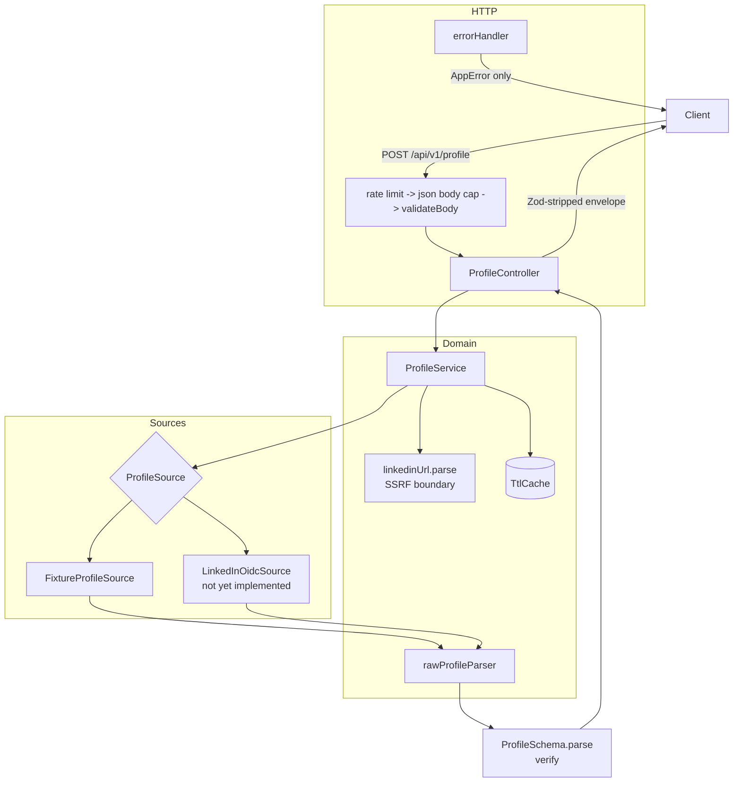

# Architecture

## The problem this shape solves

The assignment asks for an API that turns a LinkedIn profile URL into JSON.
The naive implementation is one file: take the URL, fetch it, pull fields out,
return them. That works until the data source changes — and in this domain the
data source is the single most volatile part of the system, both technically
and legally.

So the architecture is organised around one question: **how much of this code
has to change when the source of profile data changes?**

The answer here is one adapter file and one line in a factory. Nothing else.

---

## Layers



## Request flow

1. **Rate limit** — per IP, `/health` exempt.
2. **Body cap** — 10 kb. The only valid request is one short URL.
3. **`validateBody`** — Zod parses the body and *replaces* `req.body` with the
   stripped result, so a handler cannot read an attacker-supplied extra field.
4. **`ProfileService.getProfile`**
   1. `parseLinkedInProfileUrl` — throws `INVALID_PROFILE_URL` before any
      outbound call is possible. Returns a canonical form.
   2. Cache lookup, keyed on the canonical URL.
   3. `source.getProfile(canonical)`.
   4. `parseRawProfile` — raw shape to domain model.
   5. `ProfileSchema.parse` — verifies the *parser's own output*. A parser bug
      surfaces as a clean 502, not a malformed 200.
   6. Cache store.
5. **Controller** — builds the envelope and `.parse()`s it before sending.
6. **`errorHandler`** — the single exit for every failure.

---

## The four boundaries, and why each exists

### `ProfileSource` — the source boundary

```ts
interface ProfileSource {
  readonly name: string;
  readonly authorizationScope: string;
  getProfile(target: CanonicalProfileUrl): Promise<RawProfile>;
}
```

Two decisions worth defending:

**It takes `CanonicalProfileUrl`, not a string.** The URL has already passed the
host allowlist by the time an adapter sees it. If the signature took a string,
a future adapter could parse it independently and quietly skip the SSRF check.
The type system prevents that.

**`authorizationScope` is on the interface, not in a comment.** Every source
must state the basis on which it is entitled to return the data it returns.
It is surfaced at `/health`. This makes the project's central constraint a
structural property rather than a paragraph in a README nobody reads.

### `RawProfile` vs `Profile` — the shape boundary

`src/types/raw.ts` deliberately models the ugly upstream reality: dates split
into `{month, year}`, positions grouped by company, images as artifacts behind
a root URL, every field optional. `src/types/profile.ts` is the clean contract.

Keeping them separate means the public API does not inherit an upstream shape,
and the parser has real, testable work — flattening one company group holding
three roles into three `Experience` entries, resolving artifacts against a
root URL, turning `{year: 2022}` into `"2022"` rather than `"2022-undefined"`.

If the two types ever collapse into one, the abstraction has stopped earning
its keep.

### `AppError` — the failure boundary

One taxonomy, one exit point. Each error carries a machine-readable `code`, an
HTTP `statusCode`, and a `publicMessage` that is safe to send. Upstream causes
ride along in `cause` for logging only.

An unrecognised throwable becomes a generic 500 with a fixed message. A stack
trace or an upstream payload cannot reach a client, because the error handler
never serialises anything except `code` and `publicMessage`.

Note `SOURCE_UNAUTHORIZED` and `SOURCE_NOT_AUTHORIZED_FOR_URL` are distinct.
The first means the source is misconfigured. The second means the source is
healthy and authorized, but its authorization does not extend to *this*
profile — which is precisely what an OIDC source returns for anyone other than
the authenticated user. Collapsing them would hide the most interesting fact
the API has to report.

### Zod envelopes — the leak boundary

Zod strips undeclared keys on `.parse()`. Parsing the response envelope on the
way out means an unexpected upstream field cannot reach a client even if it
survived the parser. This replaces what Fastify's response serialization
schemas would have given us, at the cost of one `.parse()` call per handler.

---

## Stack decisions

| Choice | Reasoning |
|---|---|
| **Express 5** | Native async error propagation, so no `express-async-errors` wrapper. Chosen over Fastify for debugging familiarity under a deadline; the two guarantees Fastify would have provided (response serialization, log redaction) are reproduced explicitly with Zod `.parse()` and pino `redact`. |
| **Zod 4** | Single source of truth for validation, TypeScript types (`z.infer`) and the OpenAPI document (`z.toJSONSchema()`). Avoids the classic drift between a schema and a hand-written interface. |
| **pino + pino-http** | `redact` turns "never log a cookie" from a discipline into configuration. |
| **In-memory TTL cache** | Deliberately not Redis. A single-instance service does not need a network hop and a second deployable to demonstrate caching. The limitation is documented rather than engineered around. |
| **Constructor injection** | `ProfileService(source, cache)` lets tests drive unauthorized / rate-limited / malformed responses with a stub, with no network mocking anywhere in the suite. |

## Deliberately not built

Kubernetes, Kafka, microservices, a database, a queue, an auth layer for the
API itself. None are load-bearing for a single-endpoint read API, and adding
them would obscure the parts of this codebase that actually carry the design.

---

## The data-source situation

This is the architecturally significant fact about the project, so it belongs
here rather than only in the README.

There is no LinkedIn API — at any tier available without partner approval —
that returns a third party's profile by URL. Sign In with LinkedIn (OIDC)
returns the authenticated user's own name, picture and email, and nothing
else. Full profile fields sit behind partner programmes with multi-week
review. Everything else on the market is either scraping or a vendor whose
own compliance posture is contested.

The architecture responds to that by refusing to pretend otherwise. The
`ProfileSource` interface makes "which source, authorized how" an explicit,
swappable, self-describing decision, and the service works end to end today
against fixtures. If an authorized source becomes available, it is one file.

That is the honest engineering answer to the brief, and the interface is
shaped so the answer is visible in the code rather than buried in prose.